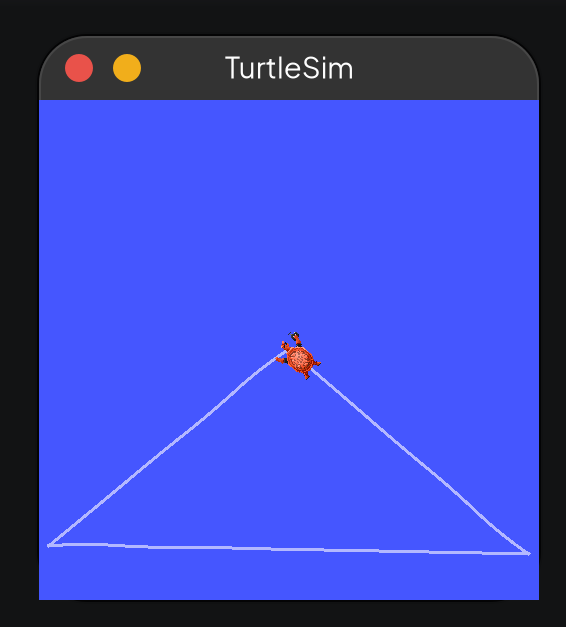
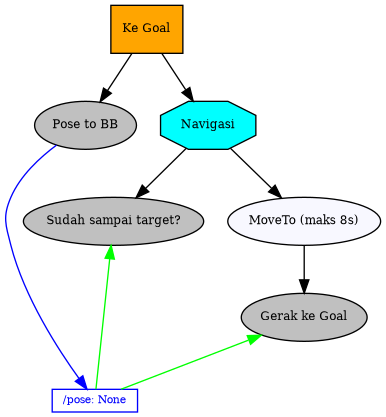

# How to run?

ketikkan di terminal:
```
ros2 run turtlesim turtlesim_node
```

di terminal yang lain (build dan source dahulu):
```
ros2 run bt_with_turtlesim bt_runner
```

Ubah ubah parameter x dan y yang ada di `main()` pada [bt_runner.py](bt_with_turtlesim/bt_runner.py) untuk membuat turtle berjalan ke titik tsb.

## Hasil


## Wujud Tree

