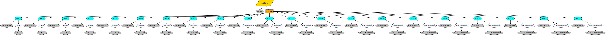
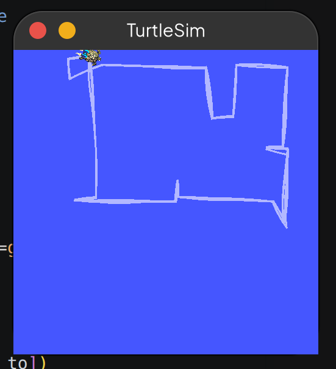

# Milestone 3 - Patrol Waypoints dengan Behaviour Tree

Implementasi patrol waypoints pada turtlesim menggunakan `py_trees` dan `py_trees_ros`. Turtle akan bergerak secara berurutan ke setiap waypoint yang sudah ditentukan menggunakan behaviour tree.

## Struktur Behaviour Tree

```
Parallel "Patrol" (SuccessOnOne)
├── PoseToBlackboard          <- selalu RUNNING, update pose setiap tick
└── Sequence "Waypoints" (memory=True)
    ├── Selector "Ke Wp 0"
    │   ├── IsAtGoal           <- cek sudah sampai?
    │   └── Timeout
    │       └── MoveTo         <- gerak ke waypoint
    ├── Selector "Ke Wp 1"
    │   ├── ...
    ...
```



## Hasil Running

Turtle bergerak secara berurutan melewati semua waypoint yang sudah ditentukan:



## Behaviour Nodes

| Node | Deskripsi |
|------|-----------|
| **PoseToBlackboard** | Subscribe ke `/turtle1/pose` dan simpan ke blackboard. Selalu return RUNNING supaya pose terus di-update setiap tick. |
| **IsAtGoal** | Cek jarak turtle ke waypoint target. SUCCESS jika jarak < toleransi (0.3), FAILURE jika belum sampai. |
| **MoveTo** | Gerakkan turtle ke waypoint menggunakan proportional controller. Publish `Twist` ke `/turtle1/cmd_vel`. Putar dulu jika heading error > 0.15 rad, lalu maju lurus. |
| **Timeout** | Decorator yang membatasi durasi MoveTo (8 detik per waypoint). |

## Cara Menjalankan

### 1. Build package

```bash
cd ~/py_trees_ws
colcon build --packages-select pytrees_patrol
source install/setup.bash
```

### 2. Jalankan turtlesim (terminal 1)

```bash
ros2 run turtlesim turtlesim_node
```

### 3. Jalankan patrol (terminal 2)

```bash
ros2 run pytrees_patrol pytrees_patrol
```

## Dependencies

- `rclpy`
- `py_trees`
- `py_trees_ros`
- `geometry_msgs`
- `turtlesim`
